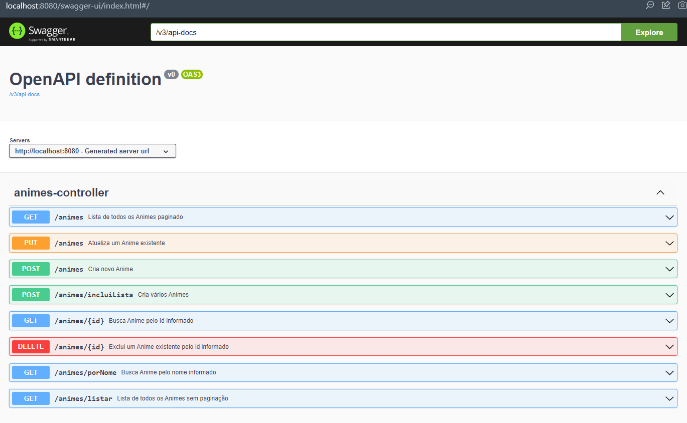

<h1> API de Gerenciamento de Animes </h1>

Api desenvolvida com Spring boot

<h2>Descrição</h2>

A aplicação é uma API desenvolvida em Java com Spring Boot.

  
<h2>Estilo Arquitetural</h2>

Action Based

<h2>Padrão de Arquitetura</h2>

MVC

<h2>Segurança</h2>
Proteção contra CSRF com gerenciamento de tokens entre cliente x servidor

 

<h2>Testes Realizados - Necessário habilitar banco h2 em application.properties</h2>

Testes de unidade do Controller - Testes de unidade nos Endpoints
 

Testes do Repositório - Validação dos métodos base do Spring Data JPA

Testes de Integração - Simulação de client Rest Template solicitando recursos da API

 

Executar o comando: mvn test 

 
Executar o comando: mvn test -Ptestes-integracao
 

ACESSO SWAGGER DOC:
1 http://<dominio-local>:8080/swagger-ui.html
 
Endpoints:

 

  
<h2>Tecnologias Aplicadas</h2>

Java 8

Apache Maven

Spring Boot

Spring IoC

Swagger

Bean Validation

Spring Data JPA

Devtools

Apache Tomcat

MySQL

IDE Spring Tool Suite

DataJpaTest

MockMvc

AssertJ

